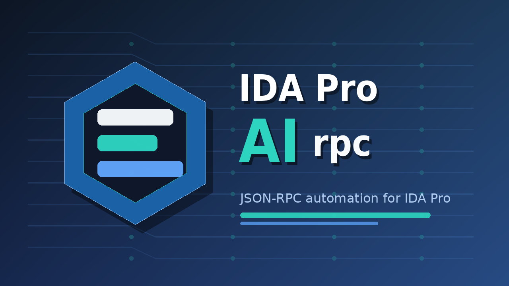

# ida-rpc



(c) B.Kerler 2026

A JSON-RPC daemon for IDA Pro, inspired by [ghidra-rpc](https://github.com/cellebrite-labs/ghidra-rpc).

Exposes IDA Pro reverse engineering capabilities over a Unix domain socket for
integration with LLM agents, automation pipelines, and multi-agent setups.

## Features

- **Human-readable CLI output** by default, with `--json` or `IDA_RPC_JSON=1` for structured JSON — faster and more reliable than MCP
- **Headless mode** — run via `ida -A` for CI/automation
- **GUI mode** — works inside the interactive IDA Pro session
- **Protocol compatible** with ghidra-rpc's CLI design
- **Full feature set**: decompile, disassemble, xrefs, rename, types, structs, enums, bookmarks, search, memory maps, patches, segments, processor context, namespaces, tags

## Quick Start

### Install

**Via the IDA Plugin Manager (recommended):**

```bash
hcli plugin install ida-rpc
```

**Or in the script path:**

```bash 
hcli plugin install .
```

**Or manually:**

```bash
pip install -e /path/to/ida-rpc
ln -s /path/to/ida-rpc/ida_rpc_plugin.py $IDAUSR/plugins/ida_rpc_plugin.py
```

Default `$IDAUSR` paths:
- **Windows:** `%APPDATA%\Hex-Rays\IDA Pro\`
- **macOS:** `~/Library/Application Support/IDA Pro/`
- **Linux:** `~/.idapro/`

### Start the daemon

For agents and automation, first ask the tool what it can do and which IDB path
to use:

```bash
ida-rpc capabilities
ida-rpc find-project /path/to/binary-or-existing.i64
ida-rpc list-loaders /path/to/binary
```

```bash
# Start headless daemon from a binary
ida-rpc open /path/to/binary --arch <arch> --headless --detach

# Or open an existing IDB
ida-rpc open --project /path/to/existing.i64 --arch <arch> --headless --detach

# For raw binaries, specify architecture and base address.
# The segment is auto-configured (class, bitness, permissions) based on arch.
ida-rpc open /path/to/raw.bin --arch arm --base 0x8000 --headless --detach

# Existing IDBs ignore raw import options such as --base and --loader.
# The requested --arch still configures processor/bitness after the IDB opens.

# When opening a system binary (e.g. /usr/bin/ls), specify a writable project path
ida-rpc open /usr/bin/ls --project /tmp/ls_analysis.i64 --arch x86 --headless --detach

# Set default project for subsequent commands
export IDA_RPC_PROJECT=/path/to/binary.i64

# Query functions
ida-rpc functions --limit 10

# Decompile main
ida-rpc decompile main

# Rename a function
ida-rpc rename-function sub_401000 my_func

# List all active daemons
ida-rpc list
```

## Command Reference

Commands print human-readable text by default. Pass `--json` (before the subcommand) or set `IDA_RPC_JSON=1` to get structured JSON. Commands that operate on an open database accept `--project <idb>` or read `IDA_RPC_PROJECT`.

### Lifecycle

| Command | Description |
|---------|-------------|
| `ida-rpc capabilities` | Print agent-discoverable command capabilities |
| `ida-rpc find-project <binary-or-idb>` | Resolve the IDB path, socket path, and recommended start command |
| `ida-rpc list-loaders [binary] [--ida-install-dir DIR]` | List loader aliases, installed IDA loaders, and file-specific candidates |
| `ida-rpc open <binary> --arch <arch> [--project <idb>] [--base <addr>] [--headless] [--detach] [--clean]` | Agent-friendly alias for `start` |
| `ida-rpc start <binary> --arch <arch> [--project <idb>] [--base <addr>] [--headless] [--detach] [--clean]` | Open binary and start daemon; `--base` applies when importing a new IDB |
| `ida-rpc start --project <idb> --arch <arch> [--headless] [--detach] [--clean]` | Open an existing database |
| `ida-rpc stop --project <idb>` | Stop daemon |
| `ida-rpc status --project <idb>` | Check daemon health, launch arch, loaded processor/settings, and loaded binary |
| `ida-rpc restart --project <idb> [--headless] [--clean]` | Restart daemon |
| `ida-rpc list` | List all active projects/daemons |
| `ida-rpc list-binaries --project <idb>` | List loaded binaries with arch, bits, endian, format, and base address |
| `ida-rpc save --project <idb>` | Save the database |

### Analysis & Listing

| Command | Description |
|---------|-------------|
| `functions [--limit N] [--offset N] [--with-body] [--address-min A] [--address-max A]` | List functions |
| `function <func>` | Show function metadata, signature, and body |
| `function-info <func>` | Rich function summary |
| `function-items <func> [--limit N]` | Instructions/items in a function |
| `function-chunks <func>` | Function chunks/ranges |
| `imports` | List imports |
| `exports` | List exports |
| `add-entry <address> [name] [--ordinal N] [--no-makecode]` | Add an entry point |
| `rename-entry <ordinal> <name>` | Rename an entry point |
| `metadata` | Binary metadata (arch, bits, endian, format, base address) |
| `relocations [--limit N]` | List relocation/fixup entries |
| `calling-conventions` | List valid calling conventions for current processor |
| `strings [query] [--limit N]` | Search strings (empty query = all) |
| `find-string <query> [--limit N] [--address A]` | Find strings matching a query |
| `symbols <query> [--limit N] [--offset N]` | Search named symbols |
| `find-bytes <pattern> [--limit N] [--address A]` | Byte pattern search (supports `??` wildcards) |
| `memory-map` | Memory segments with RWX permissions |
| `list-problems [--type T] [--limit N]` | List IDA analysis problems |
| `file-offset <address>` | Convert EA to file offset |
| `file-offset-to-ea <offset>` | Convert file offset to EA |
| `basefind <path> [--max-results N] [--min-abs-refs N] [--str-len N] [--diff-len N] [--samplerate N] [--no-filename-hints]` | Scan a flat 32-bit binary to determine its load base (runs locally) |
| `segments` | Alias for memory-map |

### Decompilation & Disassembly

| Command | Description |
|---------|-------------|
| `decompile <func> [--timeout N]` | Decompile function to pseudo-C |
| `decompile-all [--limit N] [--function <filter>]` | Bulk decompile all functions |
| `decompile-lvars <func>` | List decompiler local variables |
| `set-lvar-name <func> <lvar> <new_name>` | Rename a decompiler local variable |
| `set-lvar-type <func> <lvar> <type>` | Set a decompiler local variable type |
| `decompile-microcode <func> [--maturity N]` | Dump Hex-Rays microcode |
| `decompiler-xrefs <func> <target>` | Find decompiler-level target references |
| `basic-blocks <func> [--limit N]` | CFG basic blocks with successors/predecessors |
| `function-graph <func>` | Export a function graph |
| `call-graph [--mode callers\|callees\|both] [--title T]` | Export a call graph |
| `get-switch-info <address>` | Inspect switch/jump-table metadata |
| `disassemble <address> [--count N]` | Disassemble instructions (default 20, max 1000) |
| `assemble <address> <instruction>` | Assemble instruction text (requires Keystone Engine) |
| `read-bytes <address> <length>` | Hex dump with ASCII |
| `read-string <address> [--strtype T]` | Read a string |
| `create-string <address> <length> [--strtype T]` | Create a string item |
| `write-bytes <address> <hex>` | Patch bytes (max 4096) |
| `list-patches [--start A] [--end B] [--limit N]` | List patched bytes |
| `revert-patch <start> [--end B]` | Revert patched bytes |
| `patch-byte <address> <value>` | Patch one byte |
| `patch-word <address> <value>` | Patch a 16-bit value |
| `patch-dword <address> <value>` | Patch a 32-bit value |
| `patch-qword <address> <value>` | Patch a 64-bit value |

### Cross-References

| Command | Description |
|---------|-------------|
| `xrefs-to <target> [--limit N]` | References to target |
| `xrefs-from <target> [--limit N] [--no-stack]` | References from target |

### Annotations & Modifications

| Command | Description |
|---------|-------------|
| `rename-function <target> <new_name>` | Rename function |
| `rename-symbol <address> <new_name> [--create]` | Rename symbol |
| `create-label <address> <name>` | Create label |
| `set-comment <address> <comment> [--type plate\|pre\|post\|eol\|repeatable]` | Set comment |
| `set-signature <target> <sig>` | Set function prototype |
| `set-data-type <address> <type>` | Set data type |
| `create-function <address> [--name N]` | Create function at address |
| `delete-function <target>` | Delete a function definition |
| `create-instruction <address>` | Mark bytes at address as an instruction |
| `undefine <address> [length]` | Undefine instruction or data at address |
| `set-thunk <target> [--thunk-target <addr>] [--clear]` | Mark/unmark function as thunk |
| `set-calling-convention <target> <convention>` | Change function calling convention |
| `set-function-color <func> <color>` | Set function color |
| `function-frame <func>` | Inspect a function frame |
| `list-stack-vars <func>` | List stack variables |
| `rename-stack-var <func> (--offset N \| --old-name NAME) --new-name NAME` | Rename a stack variable |
| `set-stack-var-type <func> (--offset N \| --name NAME) --type TYPE` | Set stack variable type |
| `list-reg-vars <func>` | List register variables |
| `stack-var-xrefs <func> [--offset N] [--name NAME]` | Find stack variable references |
| `batch-rename --mode {function,symbol} --from-file <json>` | Bulk rename |
| `batch-set-comment --from-file <json>` | Bulk set comments |
| `batch --from-file <json>` | Execute multiple RPC commands in one batch |

### Lumina

Lumina commands use the primary or secondary Lumina server configured in IDA
(`Options > General > Lumina`) or overridden for the IDA session with
`-Olumina:...` / `-Osecondary_lumina:...`. Credentials are not returned.

| Command | Description |
|---------|-------------|
| `lumina-config [--secondary]` | Report Lumina configuration source and whether a configured client is available |
| `lumina-pull-signatures [target] [--all] [--apply/--no-apply] [--force] [--seen-file] [--secondary]` | Pull function signatures/metadata from Lumina |
| `lumina-push-signatures [target] [--all] [--mode better\|override\|no-override\|merge] [--min-func-size N] [--secondary]` | Push function signatures/metadata to Lumina |

### Data Types

| Command | Description |
|---------|-------------|
| `create-struct <name> <fields...> [--if-not-exists] [--or-replace]` | Create struct (fields as `TYPE NAME ...` pairs) |
| `create-union <name> <fields...> [--if-not-exists] [--or-replace]` | Create union |
| `create-enum <name> [values...] [--size 1\|2\|4\|8]` | Create enum (values as `NAME VALUE ...` pairs) |
| `modify-struct <name> --action {rename,retype,delete,set_comment} --field <name>` | Modify struct field |
| `modify-enum <name> --action {add,remove} --member <name> [--value N]` | Modify enum |
| `list-data-types [--category all\|struct\|enum\|union] [--query Q] [--limit N]` | List defined types |
| `list-labels <address> [--end <addr>] [--limit N]` | List symbols at or near an address |
| `set-equate <address> <operand> <enum> [--clear]` | Attach enum to instruction operand |
| `list-equates [--address <addr>] [--end <addr>] [--limit N]` | List all enum operands |
| `clear-data-range <start> [--end <addr> \| --length N]` | Undefine data in a range |
| `apply-data-type-range <start> <type> [--end <addr> \| --length N] [--type-size N]` | Stamp a type across a range |
| `import-til <path>` | Import a type library |
| `export-til <path>` | Export type information |
| `delete-type <name>` | Delete a named type |
| `get-type-info <name>` | Show type information |

### Segments

| Command | Description |
|---------|-------------|
| `add-segment <start> <end> [--name N] [--class C]` | Create a new segment (class defaults to CODE32/CODE16/CODE64 based on `--arch`) |
| `edit-segment <start> [--name N] [--class C] [--perm-read/--no-perm-read ...] [--bitness 0\|1\|2]` | Modify segment |
| `delete-segment <start>` | Delete a segment |

### Colors, Operands, and Exceptions

| Command | Description |
|---------|-------------|
| `operand-struct-path <address> <operand>` | Inspect operand struct path information |
| `set-color <address> <color>` | Set item color |
| `get-color <address>` | Get item color |
| `del-color <address>` | Remove item color |
| `list-try-blocks [--start A] [--end B]` | List exception/try blocks |

### Processor Context

| Command | Description |
|---------|-------------|
| `get-processor-context [--address <addr>] [--register <name>]` | Read processor context registers |
| `set-processor-context <address> <register> <value> [--end <addr>]` | Set processor context register |

### Namespaces

| Command | Description |
|---------|-------------|
| `create-namespace <namespace> [--parent <ns>]` | Validate/create namespace |
| `list-namespaces [--limit N]` | List all namespaces with symbol counts |

### Bookmarks

| Command | Description |
|---------|-------------|
| `set-bookmark <address> [--type Note\|Warning\|Error\|Info\|Analysis] [--category C] [--comment M]` | Set bookmark |
| `list-bookmarks [--type T] [--address A] [--limit N]` | List bookmarks |
| `remove-bookmark <address> [--type T]` | Remove bookmark |

### Tags

| Command | Description |
|---------|-------------|
| `tag-function <target> <tag>` | Tag a function |
| `untag-function <target> <tag>` | Remove tag from function |
| `list-tags` | List all tags with counts |
| `functions-by-tag <tag> [--limit N]` | Find functions by tag |

### Debugger

| Command | Description |
|---------|-------------|
| `debug-start [--path P] [--args A] [--sdir D]` | Start a debug session |
| `debug-attach <pid>` | Attach debugger to a process |
| `debug-detach`, `debug-exit` | Detach or exit debugger |
| `debug-continue`, `debug-suspend` | Continue or suspend execution |
| `debug-step-into`, `debug-step-over`, `debug-run-to <address>` | Step or run to an address |
| `debug-status` | Show debugger status |
| `debug-get-registers`, `debug-set-register <reg> <value>` | Read or write registers |
| `debug-read-memory <address> <length>`, `debug-write-memory <address> <hex>` | Read or write debug memory |
| `debug-breakpoints`, `debug-add-breakpoint <address>`, `debug-delete-breakpoint <address>`, `debug-enable-breakpoint <address> --enabled/--disabled` | Manage breakpoints |
| `debug-stack-trace`, `debug-modules`, `debug-threads` | Inspect runtime state |

### Navigation (GUI only)

| Command | Description |
|---------|-------------|
| `goto <target> [function\|address]` | Jump to function or address in IDA UI |

## Environment Variables

| Variable | Purpose |
|----------|---------|
| `IDA_RPC_PROJECT` | Default `--project` path |
| `IDA_INSTALL_DIR` | Path to IDA Pro installation (for auto-launch) |
| `IDA_RPC_STATE_DIR` | Directory for session JSON files (default: next to IDB) |

## Agent Usage

Codex, Kimi, and other coding agents should use `ida-rpc` automatically for
IDA-based reverse engineering. The repository includes `AGENTS.md`, `KIMI.md`,
and `SKILL.md` so agents can discover the intended workflow after install.

The stable automation probe is:

```bash
ida-rpc capabilities
```

The stable project-resolution probe is:

```bash
ida-rpc find-project /path/to/binary-or-idb
```

After that, use `open --arch <arch>`, `status`, `functions`, `decompile`, `disassemble`,
`strings`, `xrefs-to`, `xrefs-from`, `rename-function`, `set-comment`, and
`save`. Commands print human-readable text on stdout by default; pass `--json`
(before the subcommand) or set `IDA_RPC_JSON=1` for JSON output. Unexpected
CLI/RPC failures are reported on stderr as `Error: <error>: <message>` (or JSON
with `--json`); set `IDA_RPC_DEBUG=1` to also print tracebacks on stderr.

## Architecture

```
┌─────────────┐      Unix Socket       ┌──────────────────────────────┐
│  LLM agent  │  ──── JSON/newline ──→ │  ida-rpc daemon              │
│  (via CLI)  │  ←── JSON/newline ───  │  (IDA Python plugin + server)│
└─────────────┘                        └──────────────────────────────┘
```

## License

MIT
